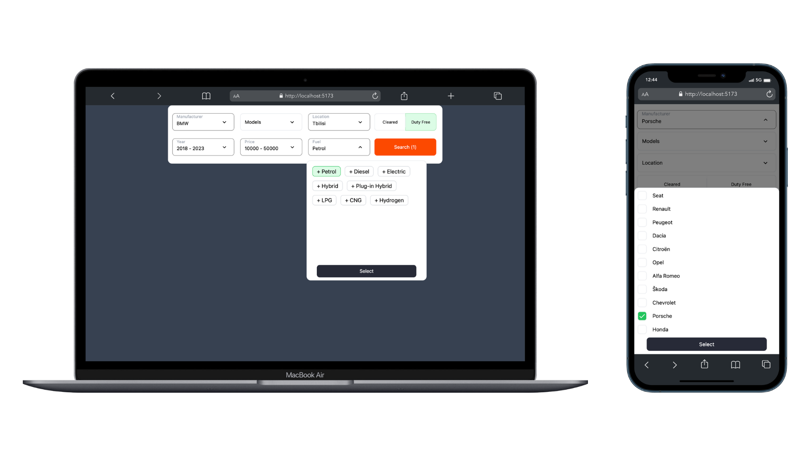
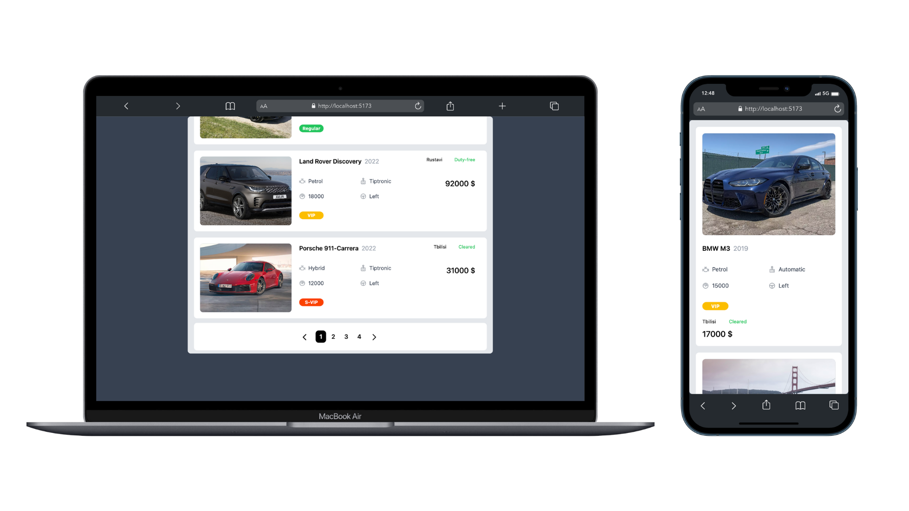
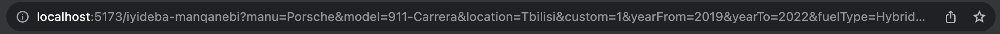

# e-auto.ge 🚙

I've always wanted to develop a filtering system similar to the one used by myauto.ge. Throughout this project, my primary focus was on data filtering, efficient routing, effective state management, maintaining a clean architecture, and crafting reusable code.





## Tech Stack

**React**, **Typescript**, **Zustand**, **TailwindCSS**, **React-router-dom**, **react-query**.

## How to run on your local machine

After cloning project don't forget to install all the dependencies with:

```javascript
    npm run install
```

and then run this to launch sever:

```javascript
    npm run start
```

This script will launch the vite server and json-server in parallel.

## Thank you for checking out my project. 🙂
